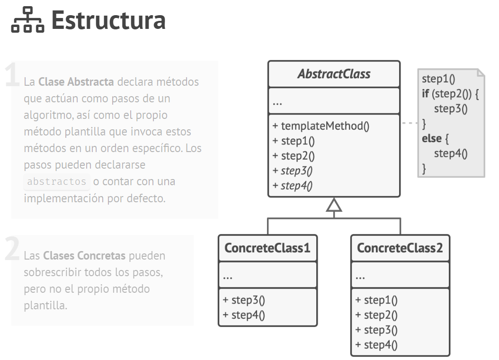

# Tema - 01 Patrones de diseño - Patron de comportamiento

## Template Method

  

### 1. Propósito

Template Method es un patrón de diseño de comportamiento que define el esqueleto de un algoritmo en la superclase pero permite que las subclases sobrescriban pasos del algoritmo sin cambiar su estructura.

#### Problema

Imagina que estás creando una aplicación de minería de datos que analiza documentos corporativos. Los usuarios suben a la aplicación documentos en varios formatos (PDF, DOC, CSV) y ésta intenta extraer la información relevante de estos documentos en un formato uniforme.

La primera versión de la aplicación sólo funcionaba con archivos DOC. La siguiente versión podía soportar archivos CSV. Un mes después, le enseñaste a extraer datos de archivos PDF

En cierto momento te das cuenta de que las tres clases tienen mucho código similar. Aunque el código para gestionar distintos formatos de datos es totalmente diferente en todas las clases, el código para procesar y analizar los datos es casi idéntico. ¿No sería genial deshacerse de la duplicación de código, dejando intacta la estructura del algoritmo?

- Etapas para realizar el proceso de minería que se lleva acabo para cualquier tipo de documento

  1. Extract
  2. AnalyzeData
  3. Map
  4. DisplayResults

