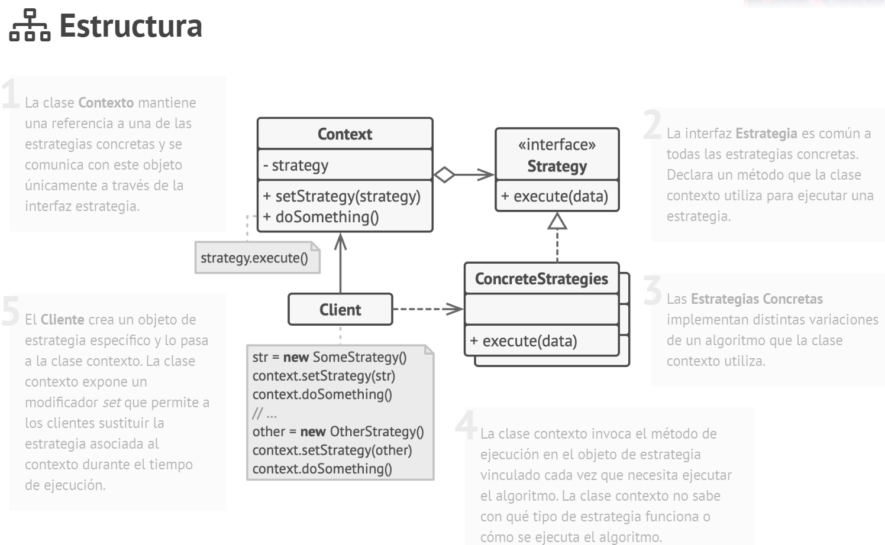

# Tema - 02 Patrones de diseño - Patron de comportamiento

## Strategy

  

### 1. Propósito

Strategy es un patrón de diseño de comportamiento que te permite definir una familia de algoritmos, colocar cada uno de ellos en una clase separada y hacer sus objetos intercambiables.

#### Problema

Un día decidiste crear una aplicación de navegación para viajeros ocasionales. La aplicación giraba alrededor de un bonito mapa que ayudaba a los usuarios a orientarse rápidamente en cualquier ciudad.
Una de las funciones más solicitadas para la aplicación era la planificación automática de rutas. Un usuario debía poder introducir una dirección y ver la ruta más rápida a ese destino mostrado en el mapa.
La primera versión de la aplicación sólo podía generar las rutas sobre carreteras. Las personas que viajaban en coche estaban locas de alegría. Pero, aparentemente, no a todo el mundo le gusta conducir durante sus vacaciones. De modo que, en la siguiente actualización, añadiste una opción para crear rutas a pie. Después, añadiste otra opción para permitir a las personas utilizar el transporte público en sus rutas.
Sin embargo, esto era sólo el principio. Más tarde planeaste añadir la generación de rutas para ciclistas, y más tarde, otra opción para trazar rutas por todas las atracciones turísticas de una ciudad.
