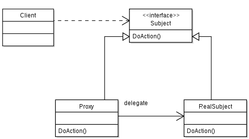
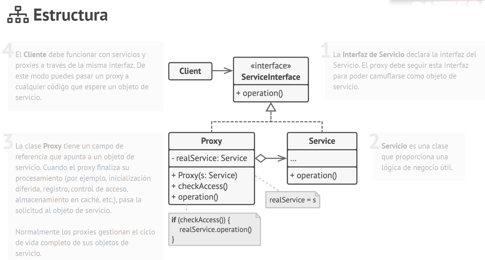

# Tema - 04 Patrones de diseño - Estructural

## Proxy

  

  

### 1. Propósito

Proxy es un patrón de diseño estructural que te permite proporcionar un sustituto o marcador de posición para otro objeto. Un proxy controla el acceso al objeto original, permitiéndote hacer algo antes o después de que la solicitud llegue al objeto original.
