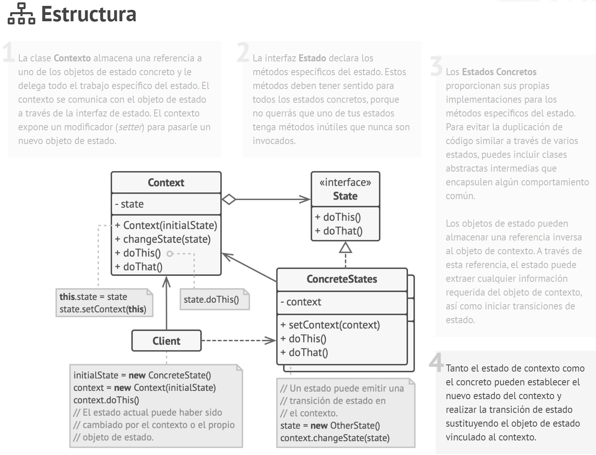
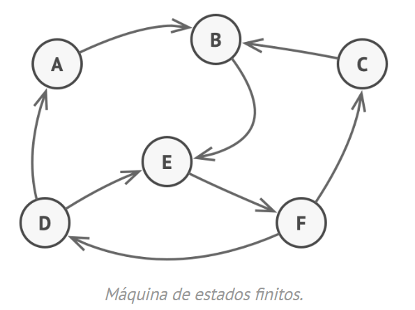

# Tema - 03 Patrones de diseño - Patron de comportamiento

## State

  

### 1. Propósito

State es un patrón de diseño de comportamiento que permite a un objeto alterar su comportamiento cuando su estado interno cambia. Parece como si el objeto cambiara su clase.

#### Problema

El patrón State está estrechamente relacionado con el concepto de la Máquina de estados finitos

  

La idea principal es que, en cualquier momento dado, un programa puede encontrarse en un número finito de estados. Dentro de cada estado único, el programa se comporta de forma diferente y puede cambiar de un estado a otro instantáneamente. Sin embargo, dependiendo de un estado actual, el programa puede cambiar o no a otros estados. Estas normas de cambio llamadas transiciones también son finitas y predeterminadas.

