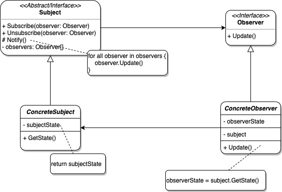
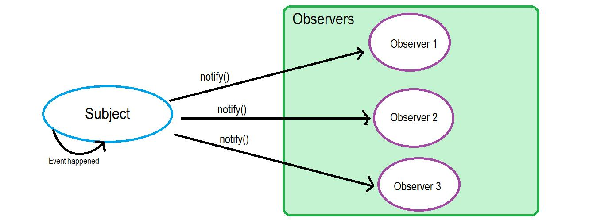

# Tema - 03 Patrones de diseño - Patron de comportamiento

## Observer

  

### 1. Propósito

El patrón de diseño Observer, también conocido como patrón observador, es uno de los patrones de diseño de software más populares. 
Este patrón se clasifica dentro de los patrones de comportamiento.

El patrón Observer establece una relación de dependencia uno a muchos entre objetos, de manera que cuando un objeto cambia su estado, todos los objetos que dependen de él son notificados y actualizados automáticamente. En esencia, el patrón Observer se basa en la idea de que un objeto, conocido como el sujeto observable o simplemente sujeto, mantiene una lista de observadores que desean ser informados sobre cualquier cambio en su estado.

  

El propósito principal del patrón Observer es permitir que un objeto notifique a sus observadores cuando se produce un cambio en su estado. Esto permite implementar una comunicación eficiente entre objetos en nuestro código, lo que nos permite diseñar sistemas más flexibles y adaptables. Este patrón es especialmente útil en situaciones en las que múltiples objetos necesitan conocer y reaccionar a los cambios en el estado de otro objeto.

