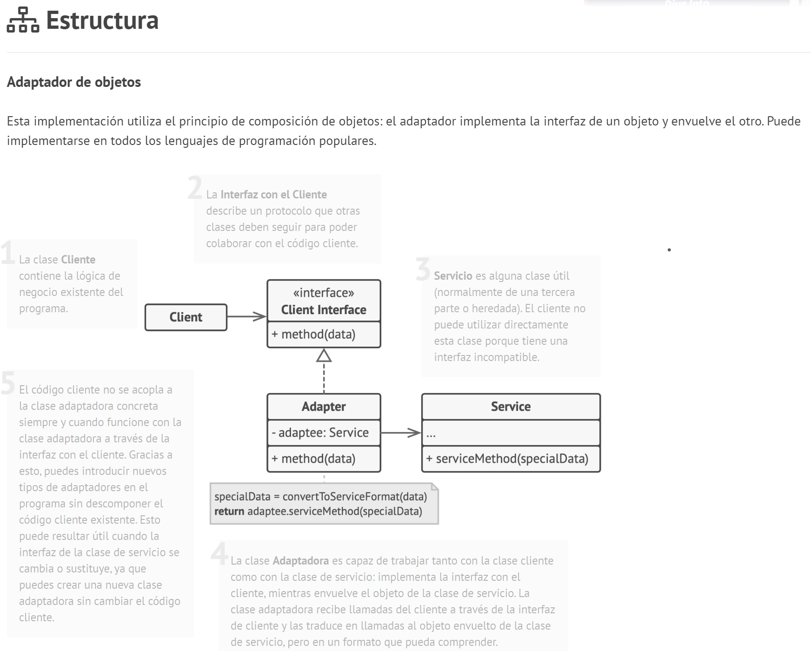

# Tema - 04 Patrones de diseño - Estructural

## Adapter

  

### 1. Propósito

Adapter es un patrón de diseño estructural que permite la colaboración entre objetos con interfaces incompatibles.

#### Problema

Supongamos que tenemos dos clases, MotorViejo y Auto, pero Auto espera una instancia de MotorNuevo

