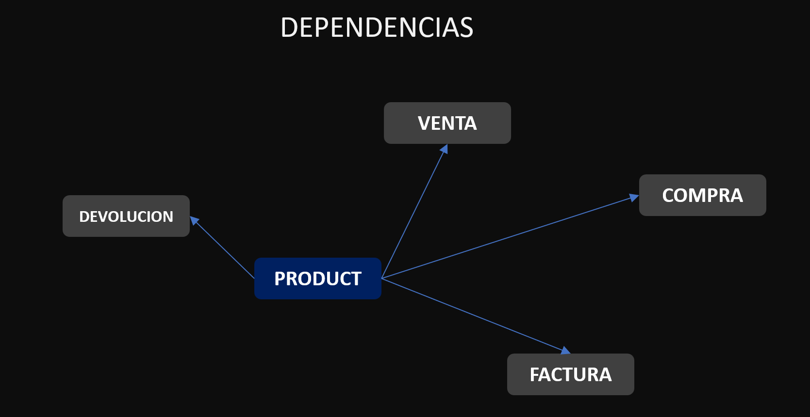

# Documentación Básica de Producto

## Dependencias

<p align="center">
  <a href="#" target="blank"></a>
</p>

## Entidad de Datos

- La estructura de datos del producto se define de la siguiente manera:

```bash
Product {
  id:           string | Character varying(40)
  code:         string | Text
  name:         string | Text
  price:        number | Numeric
  description:  string | Text
  sort:         string | Text
}
```

## Repositorio PostgreSQL

### Crea Registro

```sql

  -- ($1): Estructura json concreta.
  -- Las propiedades del objeto son requeridas
  register: {
      id: '',
      code: '',
      name: '',
      price: 0,
      description: '',
      sort: '',
  }

  -- Instrucción SQL
  SELECT providers.product_create($1);

  -- Retorno: Objeto de tipo producto
```

### Update Registro

```sql
  -- ($1): Id del producto.
  -- ($2): Estructura json concreta.
  register: {
      id: '',
      code: '',
      name: '',
      price: 0,
      description: '',
      sort: '',
  }

  -- Instrucción SQL
  SELECT providers.product_update($1,$2);

  -- Retorno: Objeto de tipo producto
```

### Leer todos los productos

```sql
  -- Instrucción SQL

  SELECT * from providers.product_gets()

  -- Retorno: Array de objeto de tipo producto
```

### Leer producto por id

```sql
  -- ($1): Id del producto.

  -- Instrucción SQL

  SELECT * from providers.product_get_by_id($1)

  -- Retorno: Array de objeto de tipo producto
```

## Notas:
